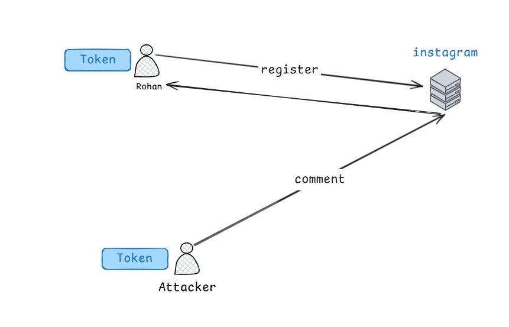
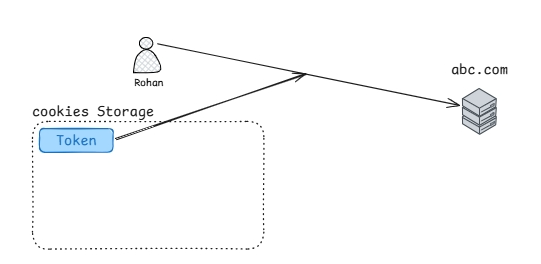
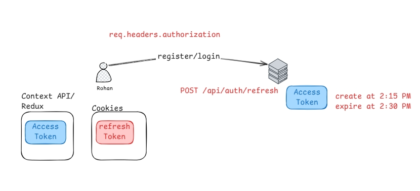
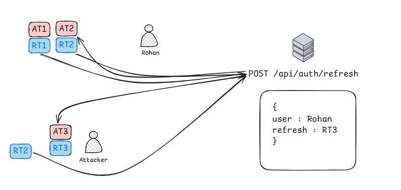

```js
// ### Problem with single token ?

// 01 Rohan registers on Instagram
// Rohan signs up and the server issues him a valid authentication token.

// 02 Server validates Rohan
// Instagram recognizes Rohan’s token as genuine, allowing him to perform actions like posting or commenting.

// 03 Attacker steals Rohan’s token
// The attacker successfully steals Rohan’s authentication token without authorization.

// 04 Attacker misuses stolen token
// Using Rohan’s token, the attacker sends abusive or harmful comments on other friends’ accounts.

// 05 Server accepts request
// Since the stolen token is valid, Instagram treats the attacker’s abusive comment as if it came from Rohan.

// token
const token = localStorage.getItem("token");
```

### Q1: Why is storing tokens in `localStorage` considered insecure?

- Tokens in `localStorage` are directly accessible to JavaScript. This makes them vulnerable to XSS attacks — if a malicious script runs in the browser, it can read and steal the token.

### Q2: What is a safer alternative to `localStorage` for storing tokens?

- A safer option is using **HTTP‑only cookies**. These cookies cannot be accessed by JavaScript, which protects tokens from XSS attacks. The browser automatically sends them with requests, so the server can validate sessions without exposing the token to client‑side scripts.

- _LocalStorage exposes tokens to XSS; HTTP‑only cookies keep them hidden from scripts and are the recommended secure alternative._

### understanding cookies storage



- Even though **HTTP‑only cookies are not accessible to JavaScript**, they are still automatically attached by the browser to every request sent to the server for that domain.

### 🔑 How it works

- When the server sets a cookie with the `HttpOnly` flag, the browser stores it securely.
- On every subsequent request to the same domain (`abc.com` in your diagram), the browser automatically includes that cookie in the request headers.
- The server reads the cookie from the request headers and validates the token/session.
- No JavaScript access is needed — the browser handles sending it behind the scenes.

- _HTTP‑only cookies aren’t accessible to JS, but the browser automatically attaches them to server requests, so authentication works without exposing the token to scripts._

- cookies solve the **XSS problem** because JavaScript can’t read them,but the problem is - **CSRF (Cross‑Site Request Forgery):** Since cookies are automatically sent with every request to the server, a malicious site can trick the browser into sending requests using the victim’s cookies.

### 🔑 Rule of cookies

- Cookies are **domain‑scoped**.
- If Rohan logs into **abc.com**, the browser only attaches that cookie when making requests to **abc.com** (or its subdomains, depending on the cookie settings).
- If Rohan visits **xyz.com**, the browser will **not** send abc.com’s cookies, because they belong to a different domain.

### ⚡ Example

```
01 Rohan logs into abc.com → browser stores cookie for abc.com
02 Rohan visits xyz.com → browser sends only xyz.com cookies (if any)
03 abc.com cookies never go to xyz.com → attacker cannot read them directly
```

👉 That’s why cookies are safe from being leaked cross‑domain.

### understanding CSRF Attack

The real risk is **CSRF**: if Rohan is logged into abc.com and visits a malicious page, the browser may still auto‑send abc.com’s cookies **to abc.com** when tricked into making a request — but never to xyz.com.

- 01 Rohan logs into abc.com → browser stores his session cookie.
- 02 Attacker tricks Rohan into visiting evil.com.
- 03 evil.com secretly makes a request to abc.com (e.g., POST /transfer).
- 04 Browser auto‑attaches Rohan’s abc.com cookie to that request.
- 05 abc.com sees a valid cookie → executes the action as if Rohan requested it.

```html
<!-- Attacker's malicious site: evil.com -->
<form action="https://abc.com/comment" method="POST">
  <input
    type="hidden"
    name="msg"
    value="Abusive comment injected by attacker"
  />
</form>

<script>
  // Auto‑submits the form when Rohan visits evil.com
  document.forms[0].submit();
</script>
```

### Concise summary

### Q. Why not store tokens in localStorage?

- Tokens in localStorage are accessible to JavaScript.
- If an attacker injects malicious scripts (XSS), they can read and steal the token.
- This compromises the user’s account.

### Q. Why are HTTP‑only cookies safer?

- HTTP‑only cookies cannot be read by JavaScript, so XSS cannot directly steal them.
- The browser automatically attaches cookies to requests for the correct domain.
- This protects tokens from client‑side exposure.

### Q. What’s the main problem with cookies?

- Cookies are vulnerable to **CSRF (Cross‑Site Request Forgery)**.
- Since the browser auto‑sends cookies, a malicious site can trick the browser into sending requests to abc.com using Rohan’s valid cookie.
- The server sees a valid cookie and executes the action, even though Rohan didn’t intend it.
- Mitigation: use `SameSite` flag, CSRF tokens, and secure cookie attributes (`Secure`, `HttpOnly`).

### understanding AccessToken and Refresh Token ?



- How does authentication with access & refresh tokens work?
  - When Rohan logs in to **abc.com**, the server issues two tokens:
    - **Access Token** (short‑lived, e.g., 15 minutes)
    - **Refresh Token** (longer‑lived, e.g., days/weeks)
  - The **Access Token** is sent in `req.headers.authorization` with each request to prove identity.
  - When the Access Token expires, the client sends the **Refresh Token** (stored securely in HTTP‑only cookies) to `/api/auth/refresh`.
  - The server validates the Refresh Token and issues a new Access Token.
  - This cycle ensures short‑lived tokens reduce risk, while refresh tokens maintain seamless sessions.

1. **Login/Register**
   - Rohan sends credentials to `abc.com`.
   - Server responds with **Access Token** + **Refresh Token**.
   - Access Token is short‑lived (e.g., created at 2:15 PM, expires at 2:30 PM).
   - Refresh Token is long‑lived and stored securely in **HTTP‑only cookies**.

2. **Using Access Token**
   - For each API call, Rohan’s client attaches the Access Token in `req.headers.authorization`.
   - Server validates it before processing the request.

3. **Access Token Expiry**
   - When the Access Token expires (after 15 minutes), the client cannot call APIs with it anymore.
   - Instead, the client sends a request to `/api/auth/refresh` with the Refresh Token (browser auto‑sends cookie).

4. **Token Renewal**
   - Server verifies the Refresh Token.
   - If valid, it issues a new Access Token.
   - This cycle repeats, keeping Rohan logged in without re‑entering credentials.

**Q: Why use short‑lived Access Tokens with Refresh Tokens?**  
**A:** Short‑lived Access Tokens reduce risk if stolen (they expire quickly). Refresh Tokens allow seamless renewal without forcing the user to log in again.

**Q: Why store Refresh Tokens in cookies instead of localStorage?**  
**A:** Cookies with `HttpOnly` + `Secure` flags protect against XSS (JavaScript cannot read them). LocalStorage exposes tokens to scripts, making them vulnerable.

**Q: What’s the main risk with cookies?**  
**A:** CSRF — since cookies auto‑attach to requests, attackers can trick the browser into sending requests with valid cookies. Mitigation: `SameSite` flag, CSRF tokens, and secure cookie attributes.

### How to prevent accessToken & Refresh Token ?



1. **Login Phase**  
   - Rohan logs in → receives **AccessToken 1 + RefreshToken 1**.  
   - AccessToken 1 expires after 15 minutes.  

2. **Refresh Cycle**  
   - Client calls `/api/auth/refresh` with **RT1**.  
   - Server issues **AccessToken 2 + RefreshToken 2**, invalidating RT1.  

3. **Attack Scenario**  
   - Attacker steals **RefreshToken 2** (via XSS, insecure storage, or leak).  
   - After AccessToken 2 expires, attacker calls `/api/auth/refresh` with stolen RT2.  
   - Server issues **AccessToken 3 + RefreshToken 3** to attacker.  
   - Meanwhile, Rohan also tries to refresh with RT2 → server rejects it (already rotated).  
   - Server detects anomaly: two different clients attempting to use the same refresh chain.  

### ⚡ Result
- Attacker now impersonates Rohan with valid **AccessToken 3**, gaining full access to his account.  
- Because refresh tokens are **rotated and stored in the DB**, the server can spot conflicts (reuse detection).  
- If anomaly is detected, the server may **invalidate the refresh chain** and force Rohan to **re‑login** to restore a secure session.  
- Without rotation + anomaly detection, attacker could keep refreshing indefinitely, silently hijacking the account.  


- Refresh tokens are stored in the database so the server can invalidate old ones and prevent reuse after rotation.

- On every new access token request, the server issues a fresh refresh token and updates it in the database, so old tokens can be invalidated and blocked from reuse.

- Each time a new access token is issued, the server also generates a new refresh token and stores it in the database, ensuring old tokens are invalidated to prevent reuse if stolen.

**Q: What happens if a refresh token is stolen?**  
**A:** The attacker can continuously generate new access tokens, maintaining long‑term access even after the original access token expires.

**Q: How do servers defend against this?**  
- **Rotation:** Issue a new refresh token each time, invalidate the old one.
- **Revocation:** Allow server to blacklist stolen tokens.
- **Anomaly detection:** Flag accounts if multiple refresh attempts conflict.
- **Secure storage:** Use HTTP‑only cookies, not localStorage.
- **Short lifetimes:** Limit refresh token validity.

- The HttpOnly flag ensures cookies cannot be accessed by JavaScript, protecting them from XSS attacks.

- Bandwidth is the maximum data transfer capacity of a network connection, measured in bits per second (bps).

**Token Blacklisting:**  
  - **Definition:** Token blacklisting is a mechanism where the server keeps a list of JWTs (or refresh tokens) that are explicitly marked as invalid.  
  - **Use case:** Needed when you want to revoke a token before its natural expiry (e.g., logout, stolen token, compromised session).  
  - **How it works:**  
    1. Server stores revoked token IDs in a DB/cache (e.g., Redis).  
    2. On each request, the server checks if the presented token exists in the blacklist.  
    3. If found → reject request; if not → proceed normally.  
  - **Pros:** Allows forced logout, immediate revocation, anomaly detection.  
  - **Cons:** Adds DB/cache lookup overhead; blacklist can grow large with millions of users.  

